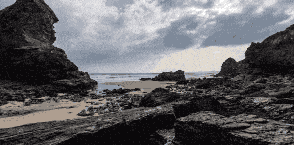

<div align="center">
<h1>THREE.6DoF</h1>
<br/>
<p>Plugin for rendering 6DoF equirectangular 360 images and video with depthmaps 🌐</p>
<br/>
<a href="#getting-started">Getting started</a> •
<a href="#examples">Examples</a> •
<a href="#api">API</a> •
<a href="#thanks">Thanks</a>
</div>

### Getting started
To quickly get started include the [latest three-6dof.js](https://github.com/juniorxsound/THREE.SixDOF/blob/master/dist/three-6dof.js) after including [three.js](https://threejs.org/docs/index.html#manual/en/introduction/Creating-a-scene) in your project. Next create your 6DoF viewer like

```js
// Create the loader
var loadingManager = new THREE.LoadingManager();
var textureLoader = new THREE.TextureLoader(loadingManager);

// Load the textures
var colorTexture, depthTexture;
textureLoader.load('360_color_image.jpg', texture => { colorTexture = texture });
textureLoader.load('360_depth_image.jpg', texture => { depthTexture = texture });

// On finish loading create the viewer with the textures
loadingManager.onLoad = () => {
    sixDofViewer = new SixDOF.Viewer(colorTexture, depthTexture);
    scene.add(sixDofViewer);
}
```

#### Using with ES6
If you are using `yarn` with ES6 you can also
```sh
yarn add https://github.com/juniorxsound/THREE.SixDOF
```

You can import the plugin by simply
```js
import { 
    Viewer,
    TextureType,
    MeshDensity, 
    Style
} from 'juniorxsound/THREE.SixDOF'
```

### Examples
- [Image live example](https://juniorxsound.github.io/THREE.SixDOF/examples/image.html) - [code](https://github.com/juniorxsound/THREE.SixDOF/tree/master/examples/image.html)
- [Video live example](https://juniorxsound.github.io/THREE.SixDOF/examples/video.html) - [code](https://github.com/juniorxsound/THREE.SixDOF/tree/master/examples/video.html)

### API
When creating a viewer you pass the following parameters
```js
const instance = new Viewer(
    colorTexture, // Or top bottom texture
    depthTexture, // Optionally
    {
        'type': TextureType.SEPERATE, // For seperate depth and texture (for single top bottom use TextureType.TOP_BOTTOM)
        'style': Style.WIRE, // Chooses the rendering style (defaults to Style.MESH)
        'density': MeshDensity.EXTRA_HIGH // Chooses geometry tesselation level
        'displacement': 4.0, // Defaults to 4.0
        'radius' : 6 // Defaults to 6
    }
)
```
For a full list of options see the [`constants.ts` file](https://github.com/juniorxsound/THREE.SixDOF/blob/master/src/components/constants.ts).

- `instance.texture` - get the `THREE.Texture`

- `instance.depth` - get the `THREE.Texture` depth map (`null` if none)

- `instance.displacement` - get or set the displacement amount

- `instance.pointSize` - get or set the point size when rendering points

- `instance.opacity` - get or set the material's opacity

- `instance.config` - returns the current config object

- `instance.toggleDepthDebug(state)` - toggle color and depth rendering (useful for debugging)

---

### Thanks
To krpano and Kandao for the depth panoramas.
